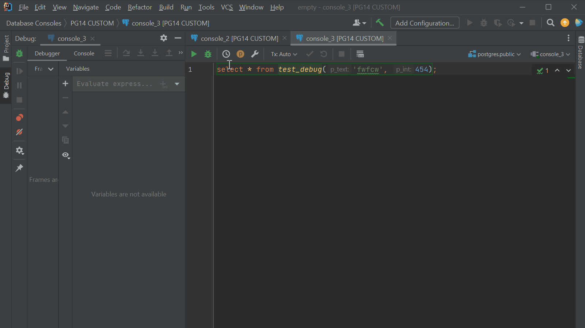
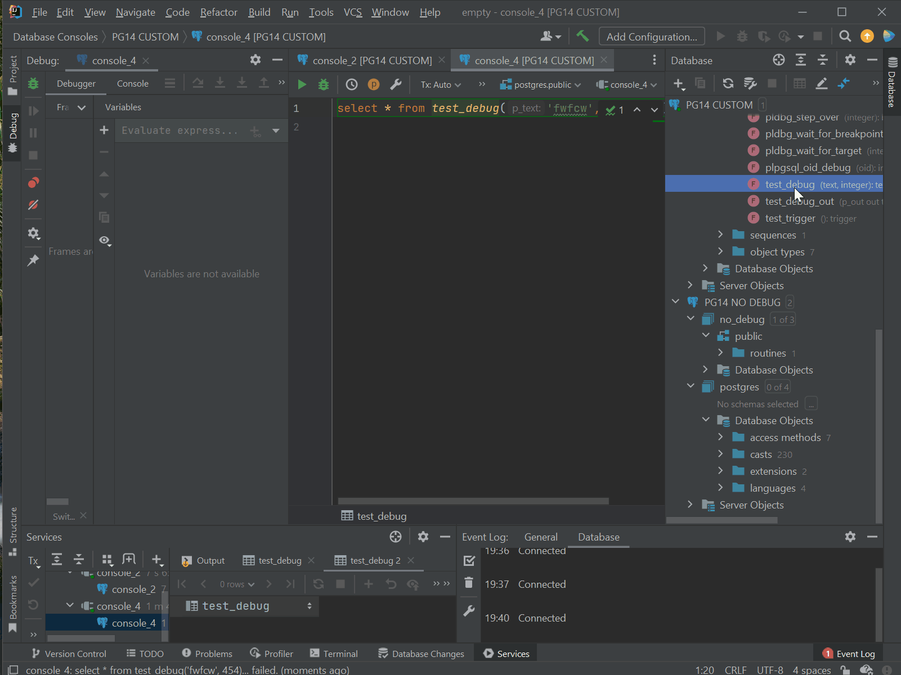
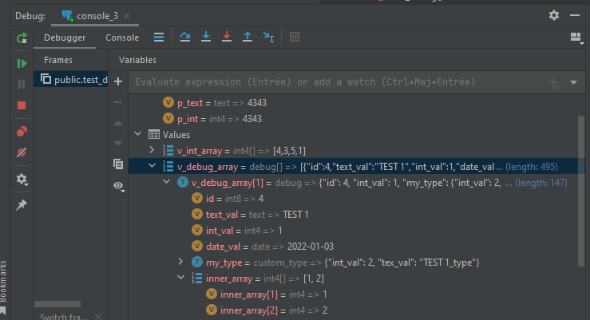
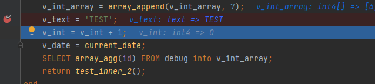
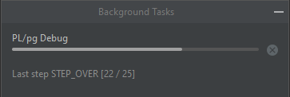

# IntelliJ PL/pgSQL Debugger

[](https://github.com/ng-galien/idea-plpgdebugger/actions/workflows/build.yml)
[](https://plugins.jetbrains.com/plugin/18419-postgresql-debugger)
[](https://plugins.jetbrains.com/plugin/18419-postgresql-debugger)

<!-- Plugin description -->
Debug PostgreSQL PL/pgSQL procedures, functions, and triggers from IntelliJ IDEA Ultimate and DataGrip.

Compatible with IntelliJ Platform build 262 (2026.2).

## Features

- Debug queries from the editor by selecting a [function call](#debug-a-routine-from-the-editor)
- Debug routines and triggers from [database explorer](#debug-a-routine-from-the-database-explorer)
- Full variable inspection with the [enhanced debugger](https://github.com/ng-galien/pldebugger/tree/print-vars/docker)

Visit the plugin [page](https://plugins.jetbrains.com/plugin/18419-postgresql-debugger) at JetBrains.  
Report a bug or a problem => [Create an issue](https://github.com/ng-galien/idea-plpgdebugger/issues/new/choose)
<!-- Plugin description end -->

## Getting started

### Install the debugger on the server

You can use the plugin with the standard `pldbgapi` extension, but you will not be able to inspect every variable type.
To get the full experience, you can use an [enhanced version](https://github.com/ng-galien/pldebugger) with the plugin.

You can compile the extension from the source code or use one of the [Docker images](https://hub.docker.com/repository/docker/galien0xffffff/postgres-debugger/general) available.

> The images are based on the official PostgreSQL images and include the debugger extension. See the available tags on Docker Hub for supported PostgreSQL versions and architectures.
> To build your own image, you can use the [Dockerfile](https://github.com/ng-galien/pldebugger/tree/print-vars/docker) provided.

```shell
docker run -p 5515:5432 --name PG15-debug -e POSTGRES_PASSWORD=postgres -d galien0xffffff/postgres-debugger:15
```

Or install the [debugger](https://www.pgadmin.org/docs/pgadmin4/development/debugger.html) binaries on your machine.

## Server configuration

The PostgreSQL server must preload the debugger library, and each database to debug must have the `pldbgapi` extension installed.

1. Add `$libdir/plugin_debugger` to `shared_preload_libraries` in `postgresql.conf`. Preserve any libraries already configured:

   ```conf
   shared_preload_libraries = '$libdir/plugin_debugger'
   ```

   Restart PostgreSQL after changing this setting.

2. Install the extension in the `public` schema of every database you want to debug:

   ```sql
   CREATE EXTENSION IF NOT EXISTS pldbgapi WITH SCHEMA public;
   ```

3. Verify both settings:

   ```sql
   SHOW shared_preload_libraries;
   SELECT extname, extnamespace::regnamespace
   FROM pg_extension
   WHERE extname = 'pldbgapi';
   ```

### Debug a routine from the editor

Just write a statement using the function you want to debug

```sql
--This is a statement in a console or in a file
SELECT function_name(args);
```
(click on the debug icon on the top left of the editor)



### Debug a routine from the database explorer



(Right-click on the routine you want to debug and select "Debug Routine")

### Variable inspection

In the variables tab you can inspect:

- Primitive types
- Arrays
- JSON

With the docker image you can also inspect:

- Composite types
- Record types



### Inline values

Arguments and variables are displayed in the code editor  



### Debug process

The debug session is displayed as a background process. You can stop it by clicking on the stop icon. 

When you stop the debug session, the process is killed on the server side.  

If you debug a routine from the code editor, the process is automatically killed when you close the editor.  

If you debug a routine from the database explorer, the process remains active until you stop manually.



## Limitation of the standard pldbgapi

The standard `pldbgapi` does not return composite variables, but you can place them in arrays to inspect them.

## Installation

### Debugger binaries

You must first install the debugger extension and activate the shared library on the server.

```shell
export TAG=16 # Choose the PostgreSQL major version matching your server
export PG_LIB=postgresql-server-dev-${TAG}
export PG_BRANCH=REL_${TAG}_STABLE
export PLUGIN_BRANCH=print-vars

# Install dependencies
apt --yes update && apt --yes upgrade && apt --yes install git build-essential libreadline-dev zlib1g-dev bison libkrb5-dev flex $PG_LIB
cd /usr/src/
# Install postgres source
git clone -b $PG_BRANCH --single-branch https://github.com/postgres/postgres.git
# Setup postgres
cd postgres && ./configure
# Install debugger extension
cd /usr/src/postgres/contrib
git clone -b $PLUGIN_BRANCH --single-branch https://github.com/ng-galien/pldebugger.git
cd pldebugger
# Compile with the same options as postgres
make clean && make USE_PGXS=1 && make USE_PGXS=1 install
```

Follow these [instructions for pgAdmin](https://www.pgadmin.org/docs/pgadmin4/development/debugger.html) for a standard installation.


### IntelliJ IDEs

- Using IDE built-in plugin system:

  <kbd>Settings/Preferences</kbd> > <kbd>Plugins</kbd> > <kbd>Marketplace</kbd> > <kbd>Search for "PostgreSQL Debugger"</kbd> >
  <kbd>Install Plugin</kbd>

- Manually:

  Download the [latest release](https://github.com/ng-galien/idea-plpgdebugger/releases/latest) and install it manually using
  <kbd>Settings/Preferences</kbd> > <kbd>Plugins</kbd> > <kbd>⚙️</kbd> > <kbd>Install plugin from disk...</kbd>

## Development

The build requires JDK 21. Use the Gradle wrapper included in the repository:

```shell
./gradlew check testDataGrip262 buildPlugin verifyPlugin \
  -PlocalIdePath="/path/to/DataGrip-2026.2.1" \
  -PdataGrip262Path="/path/to/DataGrip-2026.2.1"
```

The PSI and DatabaseTools regression tests run against the latest supported
DataGrip patch release (2026.2.1). Pass the installed IDE path to both the
test task and Plugin Verifier:

```shell
./gradlew testDataGrip \
  -PdataGrip262Path="/path/to/DataGrip-2026.2.1"
./gradlew verifyPlugin \
  -PdataGrip262Path="/path/to/DataGrip-2026.2.1"
```

CI downloads these exact releases from JetBrains and validates their checksums.
Explicit paths also avoid a temporary `DB`/`DG` product-code mismatch in the
JetBrains release resolver. Without `localIdePath`, the main compilation target
is the unified IntelliJ Platform 2026.2 distribution. The packaged plugin is
created under `build/distributions`.

The current release line targets IntelliJ Platform builds `262` through `262.*`. A push to the `262` branch runs the build, tests on DataGrip 2026.2, and Plugin Verifier against that release before creating a draft GitHub release. Publishing that draft triggers signing and publication to JetBrains Marketplace.

---
Plugin based on the [IntelliJ Platform Plugin Template][template].

[template]: https://github.com/JetBrains/intellij-platform-plugin-template
